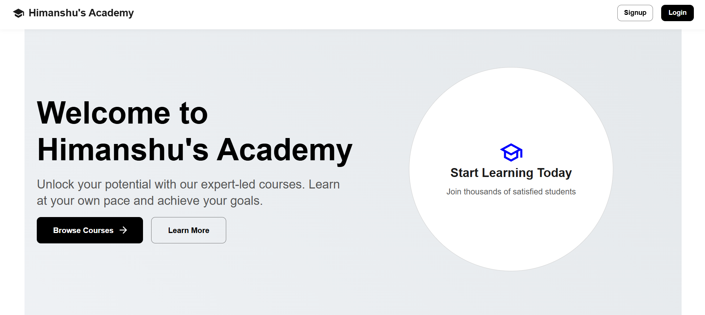

# Himanshu's Academy 🎓

[](https://github.com/hit-man-shu/Himanshu-s-Academy/commits/main)
[](https://github.com/hit-man-shu/Himanshu-s-Academy)

An online learning platform with **user** and **admin** interfaces built with MERN stack.

🔗 **Live Demo**: [Coming Soon]()  
📂 **GitHub Repo**: [github.com/hit-man-shu/Himanshu-s-Academy](https://github.com/hit-man-shu/Himanshu-s-Academy)

 <!-- Replace with actual screenshot -->

## Features

### 👨‍🎤 User Side

- JWT Authentication (Login/Signup)
- Course Catalog & Details
- Protected Routes
- Responsive MUI Design

### 👨‍💼 Admin Side

- Separate Admin Dashboard
- Role-Based Access Control
- Admin Management
- Secure API Endpoints

## Tech Stack

### Frontend

| Tech              | Usage              |
| ----------------- | ------------------ |
| React             | Frontend Framework |
| React Router v7   | Routing            |
| TanStack Query    | Data Fetching      |
| Material-UI (MUI) | UI Components      |
| Axios             | HTTP Client        |

### Backend

| Tech     | Usage            |
| -------- | ---------------- |
| Node.js  | Runtime          |
| Express  | Server Framework |
| MongoDB  | Database         |
| Mongoose | ODM              |
| Zod      | Data Validation  |
| JWT      | Authentication   |


## 📁 Project Structure
```bash
Himanshu-s-Academy/
├── client/               # Frontend
│   ├── public/
│   └── src/
│       ├── common/       # Shared components
│       ├── pages/        # Page components
│       ├── utils/        # Auth, API config
│       └── App.tsx       # Main router
│
├── server/               # Backend
│   ├── controllers/
│   ├── models/
│   ├── routes/
│   ├── middlewares/
│   └── app.js            # Server entry
│
├── .gitignore
└── README.md
```
---

## ⚙️ Getting Started

### Prerequisites

- Node.js
- MongoDB
- npm / yarn

### Clone the Repository

```bash
git clone https://github.com/hit-man-shu/Himanshu-s-Academy.git
cd Himanshu-s-Academy
```

### Install Dependencies

cd frontend
npm install

cd backend
npm install

## 🌐 Environment Variables

### Backend-

```bash
PORT=
MONGODB_URI=your_mongodb_connection_string
USER_JWT_SECRET=your_user_secret_key
ADMIN_JWT_SECRET=your_admin_secret_key
```

### FrontEnd-
```bash
VITE_BACKEND_API_URL=
```

## 📡 API Overview

| Route                  | Method | Description           |
| ---------------------- | ------ | --------------------- |
| `/api/course`          | GET    | Fetch all courses     |
| `/api/course/:id`      | GET    | Get single course     |
| `/api/user/signup`     | POST   | User registration     |
| `/api/user/login`      | POST   | User login            |
| `/api/user/purchase`   | POST   | Purchase a course     |
| `/api/user/my/courses` | GET    | View enrolled courses |
| `/api/admin/create`    | POST   | Create a course       |
| `/api/admin/edit`      | PUT    | Edit a course         |
| `/api/admin/:id`       | DELETE | Delete a course       |

## 📝 License

This project is licensed under the MIT License.

## 📌 First Commit

```bash
git add .
git commit -m "Initial project setup"
git branch -M main
git push -u origin main


---

Let me know if you'd like to include deployment instructions (e.g., for Vercel/Render) or database schema references too.
```
